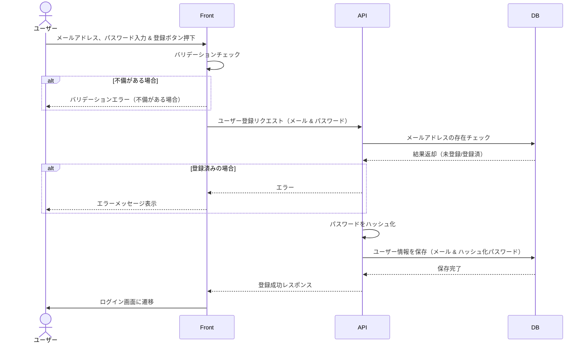
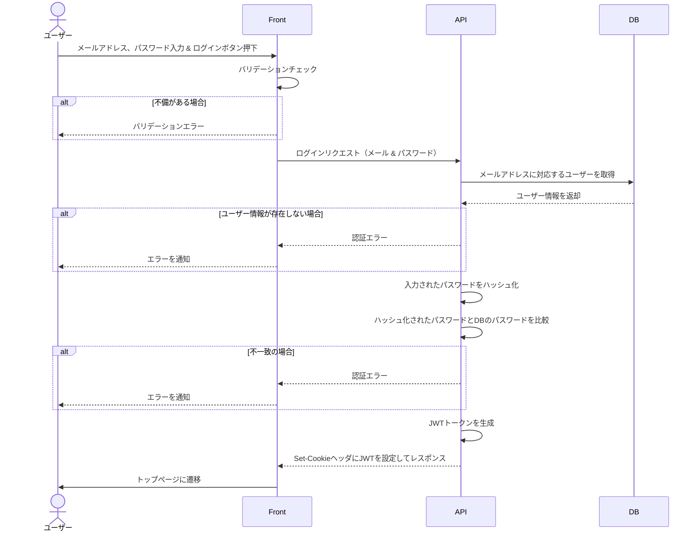

**目次**

- [ユーザー登録](#ユーザー登録)
- [ログイン](#ログイン)

# ユーザー登録

```mermaid
sequenceDiagram
    actor ユーザー
    participant Front
    participant API
    participant DB

    ユーザー->>Front: メールアドレス、パスワード入力 & 登録ボタン押下
    Front->>Front: バリデーションチェック
    alt 不備がある場合
        Front-->>ユーザー: バリデーションエラー（不備がある場合）
    end

    Front->>API: ユーザー登録リクエスト（メール & パスワード）
    API->>DB: メールアドレスの存在チェック
    DB-->>API: 結果返却（未登録/登録済）
    alt 登録済みの場合
        API-->>Front: エラー
        Front-->>ユーザー: エラーメッセージ表示
    end

    API->>API: パスワードをハッシュ化
    API->>DB: ユーザー情報を保存（メール & ハッシュ化パスワード）

    DB-->>API: 保存完了
    API-->>Front: 登録成功レスポンス

    Front->>ユーザー: ログイン画面に遷移
```

# ログイン

```mermaid
sequenceDiagram
    actor ユーザー
    participant Front
    participant API
    participant DB

    ユーザー->>Front: メールアドレス、パスワード入力 & ログインボタン押下
    Front->>Front: バリデーションチェック
    alt 不備がある場合
        Front-->>ユーザー: バリデーションエラー
    end

    Front->>API: ログインリクエスト（メール & パスワード）
    API->>DB: メールアドレスに対応するユーザーを取得
    DB-->>API: ユーザー情報を返却
    alt ユーザー情報が存在しない場合
        API-->>Front: 認証エラー
        Front-->>ユーザー: エラーを通知
    end

    API->>API: 入力されたパスワードをハッシュ化
    API->>API: ハッシュ化されたパスワードとDBのパスワードを比較
    alt 不一致の場合
        API-->>Front: 認証エラー
        Front-->>ユーザー: エラーを通知
    end

    API->>API: JWTトークンを生成
    API-->>Front: Set-CookieヘッダにJWTを設定してレスポンス

    Front->>ユーザー: トップページに遷移
```
